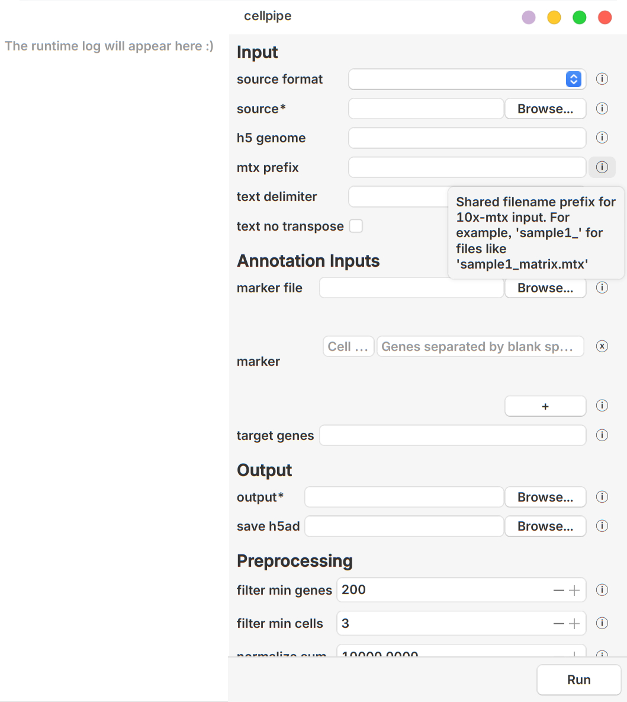
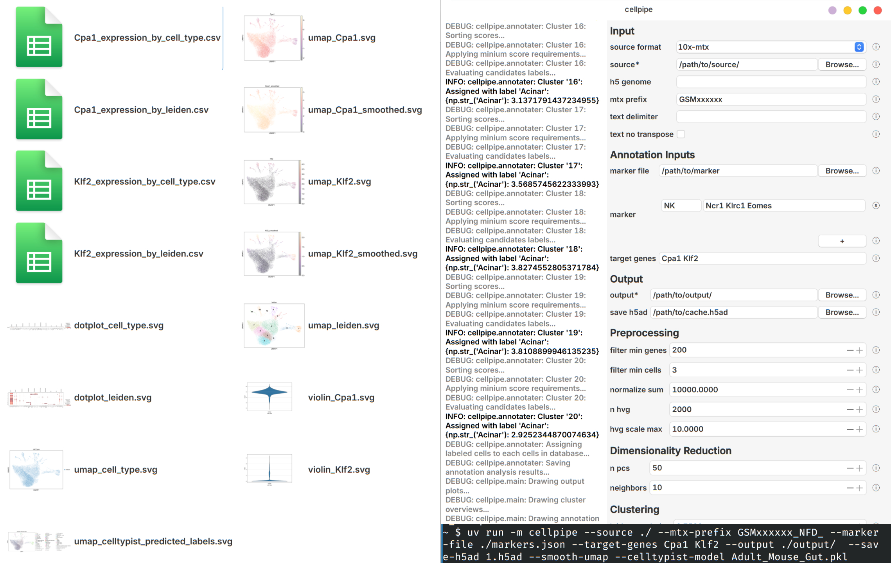

# cellpipe
A simple Python tool for running a typical single-cell RNA-seq workflow with **Scanpy**, either from the **command line** or through an **optional GUI**.
It is designed for anyone who want a quick and manageable wrapper for routine scRNA-seq analysis. It is useful for dataset exploration, quick visualization, parameter tuning, and marker-based annotation, while still keeping the workflow transparent and editable. The saved .h5ad cache can also be used with visualization tools such as [cellxgene](https://github.com/chanzuckerberg/cellxgene) for interactive exploration.

---

## Features
- Command-line workflow with optional **GUI**
- Supports multiple input formats:
  - `H5AD`
  - `10x HDF5`
  - `10x Matrix Market`
  - plain text tables
- Typical Scanpy workflow:
  1. Load input dataset
  2. Parse marker definitions
  3. Preprocess the data: filtering, normalization, HVG selection, PCA
  4. Build the neighborhood graph
  5. Run Leiden clustering
  6. Compute UMAP
  7. Annotate cell types
  8. Generate plots
  9. Summarize target genes
- **Marker-based** cell type annotation
- Optional **CellTypist** annotation
- **Stage-based caching** with validation, making parameter experiments much faster
- **SVG** figures for easy postprocessing in vector editors
- **CSV** summaries for quick inspection in text viewers or spreadsheet software
- Marker definitions can be edited from the CLI or directly in the GUI
- Modular Python code for users who want to customize the workflow
- **Beginner-friendly** help messages

---

## Installation
To install directly from GitHub:
```bash
pip install git+https://github.com/red-bean-pasta/cellpipe.git
```

To install with uv:
```bash
uv tool install git+https://github.com/red-bean-pasta/cellpipe.git
```
> When installed with uv, app runs in an isolated environment and may not follow the system's native theme

### Dependencies
- Python
- Scanpy
- CellTypist (optional)
- PySide6 (optional)
> Tested on Python 3.14
> Backward compatibility with older Python 3 versions has not been fully verified yet.

---

## Quick start
### Command-line example
```bash
cellpipe \
  --source ./source \
  --source-format 10x-mtx \
  --mtx-prefix GSMxxxxxxx_NFD_ \
  --marker-file markers.json \
  --marker Macrophage Csf1r \
  --target-genes Usp13 \
  --output ./results \
  --save-h5ad ./run1.h5ad
```
> `--source-format` can be omitted for automatic detection.

### GUI example
```bash
cellpipe
```
> Running without arguments launches the GUI if PySide6 is installed.

---

## GUI




> Optional

The GUI is optional and built with **PySide6**.  
It has a **console pane** for logs and progress updates and a **properties pane** for editing arguments through widgets such as file choosers and checkboxes.
This makes it easier for users who are unfamiliar with CLI. This also allows running without remembering command-line flags, while still keeping the same workflow and options as the CLI.

<br clear="right"/>

---

## Marker-based annotation
Markers can be supplied from a JSON file, directly from the command line, or both. If both are provided, they will be merged.

### JSON marker file example
```json
{
  "Acinar": ["Cpa1"],
  "Ductal": ["Sox9"],
  "Macrophage": ["Csf1r", "Cd68", "Mertk"]
}
```

### CLI marker definition example
```bash
python -m cellpipe \
  --source sample.h5ad \
  --marker Tcell CD3D CD3E \
  --marker Bcell MS4A1 CD79A \
  --output ./results
```

---

## CellTypist annotation

> Optional

CellTypist is a library that annotates cell types in single-cell RNA-seq datasets using global reference models and a community-driven cell type encyclopedia.  
It can be used alongside marker-based annotation as an additional reference.

> **NOTE:** CellTypist may require substantial memory on large datasets. 
> On machines with limited RAM, the process may be terminated by the system, especially when majority voting is enabled.

---

## Caching and reuse
`cellpipe` separates **what to load** from **what to save**.
Loading a dataset, whether raw input or a cached `.h5ad`, does not overwrite the source file. Users must explicitly provide `--save-h5ad` if they want for new save. This makes experimentation safer and more convenient.

For example:
```bash
cellpipe --source ./mtx_source/ --save-h5ad 1.h5ad --leiden-resolution 0.8
cellpipe --source 1.h5ad --save-h5ad 2.h5ad --leiden-resolution 1.0
cellpipe --source 2.h5ad --save-h5ad 3.h5ad --leiden-resolution 1.2
```

### What is cached
`cellpipe` caches these stages:
- preprocessing:
  - filtering
  - normalization
  - log transform
- highly variable gene selection
- PCA
- neighbor graph
- Leiden clustering
- UMAP
Annotation is **not** cached.

### How reuse works
Each stage stores metadata in `data.uns`. Metadata is validated against the current run arguments. If parameter changes, corresponding stage and all downstream stages are recomputed. This makes parameter sweeps much more convenient without rerunning everything from scratch.
However, invalidate preprocessing, being the first stage, will result in immediate error and require runing from the original input source. This avoids bloating the cached file.

---

## Outputs
`cellpipe` writes figures as **SVG** and summaries as **CSV**.
- **SVG** makes downstream figure editing much easier in vector graphics tools.
- **CSV** makes it easy to inspect results in text editors or spreadsheet software.

Example outputs when run with `Usp13` and `Usp11` as target genes:
```text
dotplot_leiden.svg
dotplot_cell_type.svg
umap_leiden.svg
umap_cell_type.svg
umap_Usp11.svg
violin_Usp11.svg
umap_Usp13.svg
violin_Usp13.svg
Usp11_expression_by_leiden.csv
Usp11_expression_by_cell_type.csv
Usp13_expression_by_leiden.csv
Usp13_expression_by_cell_type.csv
```



---

## Important options
### Input
- `--source-format {h5ad,10x-h5,10x-mtx,text}`
- `--source PATH`
- `--h5-genome GENOME`
- `--mtx-prefix PREFIX`
- `--text-delimiter DELIM`
- `--text-no-transpose`
### Annotation inputs
- `--marker-file PATH`
- `--marker CELL [GENE ...]`
- `--target-genes TARGET_GENES [TARGET_GENES ...]`
### Output
- `--output PATH`
- `--save-h5ad PATH`
### Preprocessing
- `--filter-min-genes N`
- `--filter-min-cells N`
- `--normalize-sum N`
- `--n-hvg N`
- `--hvg-scale-max X`
### Dimensionality reduction
- `--n-pcs N`
- `--n-neighbors N`
### Clustering
- `--leiden-resolution X`
- `--leiden-seed INT`
### UMAP
- `--umap-min-dist X`
- `--umap-spread X`
- `--umap-seed INT`
- `--smooth-umap`
### Annotation
- `--annot-min-score X`
- `--annot-min-margin X`
- `--celltypist-model MODEL`
- `--celltypist-majority-voting`

For the full option reference, run:
```bash
cellpipe --help
```

---

## Limitations
- Negative markers are not supported in marker-based annotation
- Marker-based annotation depends on the quality of the provided marker genes
- For advanced or highly customized projects, users will eventually want to move to direct scripting
